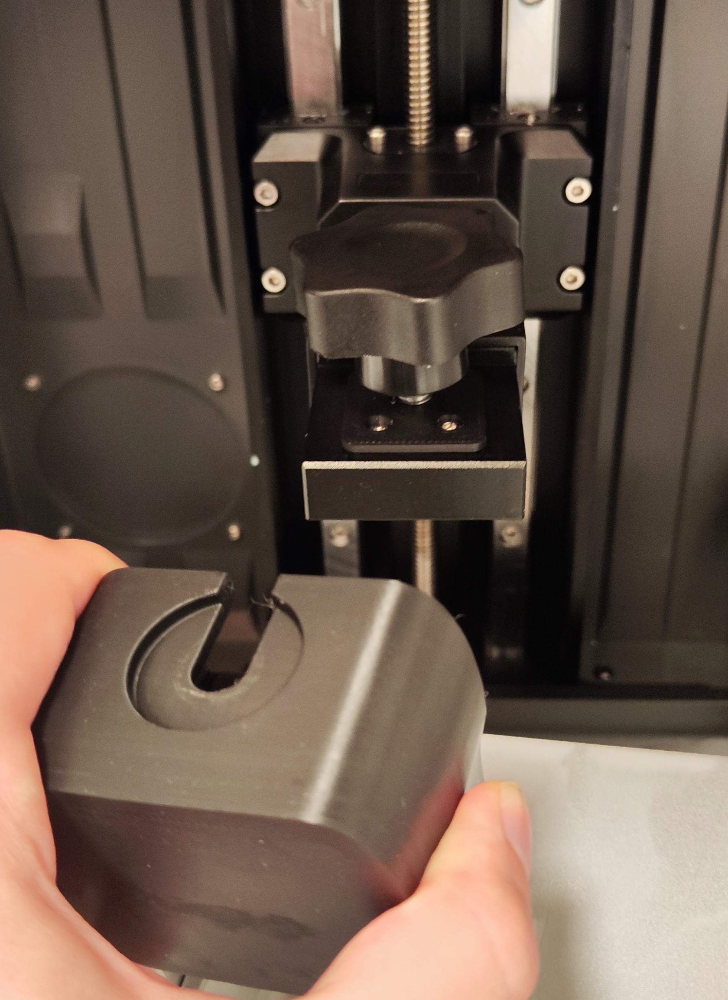
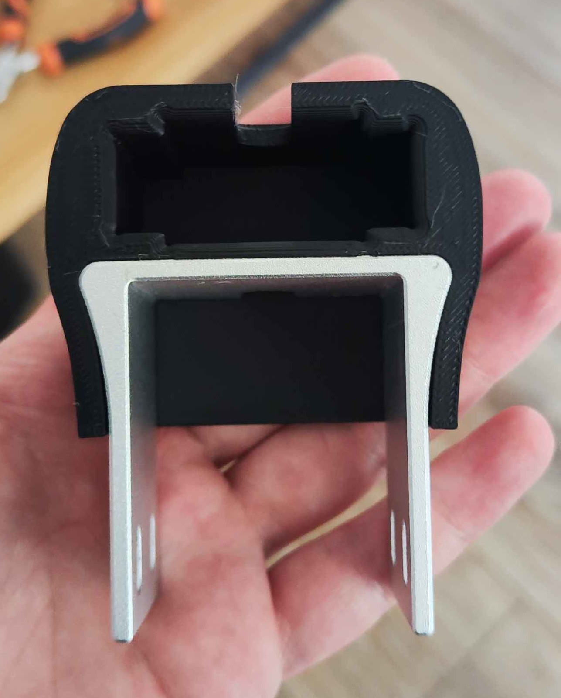

# Adapter for anycubic Mono X plate (mine is from mono X 6K)

You will need to replace locking mechanism with insert (need ti print part, hex nut, 2 threaded inserts and 2 screws)
Adapter uses friction fit, I printed mine with PLA 5 walls, 100% infill on bambulab x1c and it fits perfectly.

1. [Step File](anycubic_plate_adapter.step)
2. Images
   
   
   
3. Results
   
